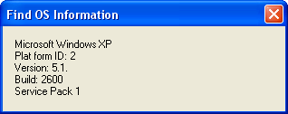

## Find OS \(Operating System\) Information

### Description

**UPDATED** Finds the OS (Operating System) information of the computer the app is running on. Please give feedback and vote if you like.
 
### More Info
 

             |
---                |---
**Submitted On**   |2003-07-21 05:53:02
**By**             |[Mike Simmonds](https://github.com/Planet-Source-Code/PSCIndex/blob/master/ByAuthor/mike-simmonds.md)
**Level**          |Advanced
**User Rating**    |5.0 (25 globes from 5 users)
**Compatibility**  |VB 6\.0
**Category**       |[Miscellaneous](https://github.com/Planet-Source-Code/PSCIndex/blob/master/ByCategory/miscellaneous__1-1.md)
**World**          |[Visual Basic](https://github.com/Planet-Source-Code/PSCIndex/blob/master/ByWorld/visual-basic.md)
**Archive File**   |[Find\_OS\_\(O1618207212003\.zip](https://github.com/Planet-Source-Code/mike-simmonds-find-os-operating-system-information__1-47027/archive/master.zip)

